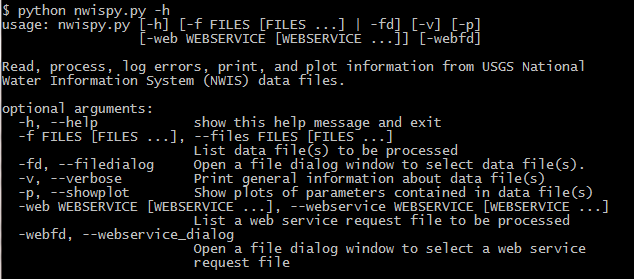
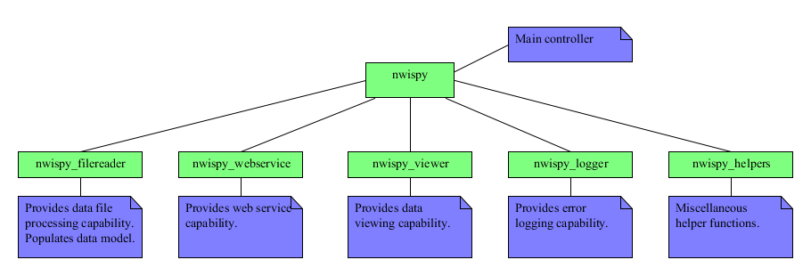
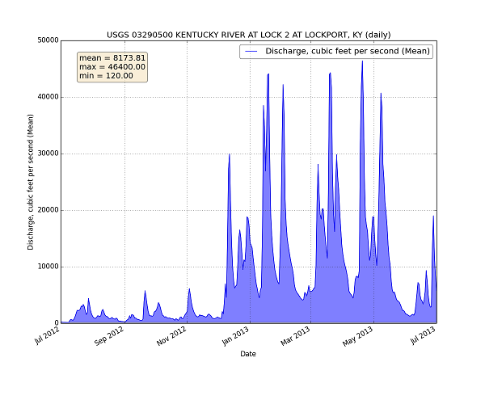
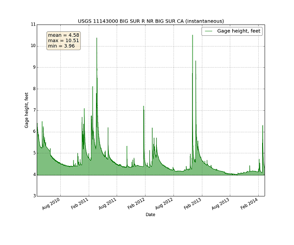
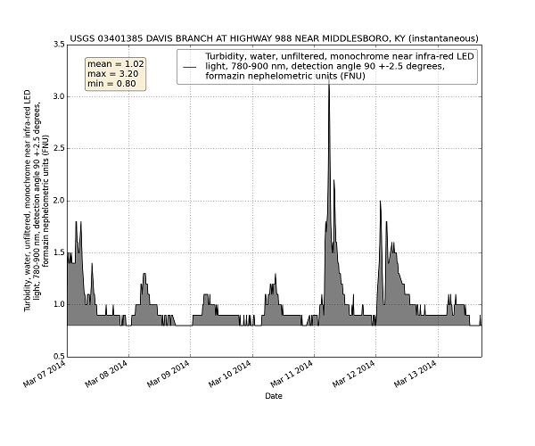
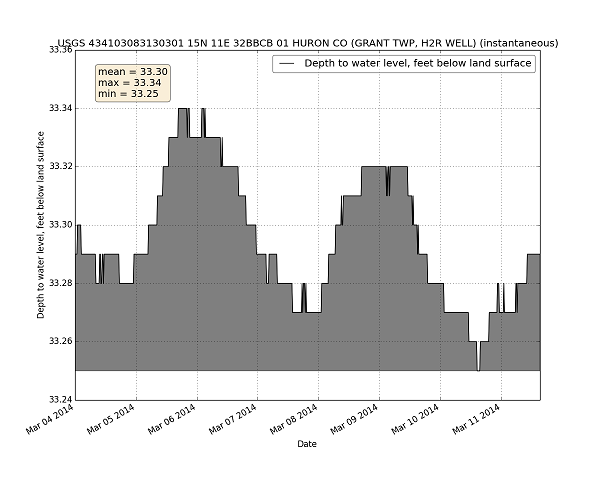

nwispy
======

Version
-------
1.0.0

Description
-----------
*nwispy* is a command line tool for analysing U.S. Geological Survey (USGS) water resource data 
collected nationwide on rivers and streams by USGS gages and instruments. The National Water
Information System (NWIS) is the Nation's principal repository of water resources data.  Most NWIS
data can be accessed directly at:

http://waterdata.usgs.gov/nwis/

and for real-time data for surface water, ground water, or water-quality data:

http://waterdata.usgs.gov/nwis/rt

Some sample highlights include:

* Processes USGS NWIS data files
* Generates and saves plots of all parameters found in USGS NWIS data files
* Retrieves and processes NWIS data files using USGS web services
* Logs erroneous data found in NWIS data files 
* Unix friendly

*nwispy* can read, process, plot, and print data and information from NWIS daily, instantaneous (real-time), 
and/or site data files. The NWIS data files can come from any USGS site nationwide and can contain any
number of parameters (discharge, gage height, temperature, precipitation, sediment concentration, 
turbidity, depth to water level, etc.).  Time-series plots are automatically created and saved for all 
parameters displaying relevant statistics (mean, maximum, and minimum) with detailed axes and title descriptions.  

*nwispy* has web service capability to automatically retrieve and process NWIS data files based on a tab-delimited
user request file. Details of the USGS web services can be accessed at:

http://waterservices.usgs.gov

Please see [General Instructions](#general-instructions) for details on *nwispy*'s web service capability.

*nwispy* automatically tracks, notifies user about, and creates a log file called *warn.log* that specifies for
the user missing or erroneous data values contained in NWIS data file(s).  The *warn.log* file is only created if
missing or erroneous data values are found.  In addition, if a web service error or any other application wide 
error occurs, a file called *exception.log* is created containing the details of the error.  To help solve the error
the *exception.log* can be emailed to the author.  Please see [General Instructions](#general-instructions) for details on error logging. 

*nwispy* is written in Python and has been built to be a "Unix friendly" tool, meaning it can be placed anywhere 
along a Unix pipeline. *nwispy* has a help menu that lists the current command line arguments/options that can be 
passed to *nwispy*. At this time, users can run *nwispy* using a shell with the appropriate flags to process NWIS 
files either stored locally on a user's machine or *nwispy* can retrieve and process files from the web based on 
a user request file.Please see [General Instructions](#general-instructions) for details on how to use nwispy. 

For full code documentation and tutorial on how to use *nwispy*, please visit:

http://ky.water.usgs.gov/usgs/projects/jlant_program_code/nwispy/html/index.html

For upcoming developments, please see [In the Works](#in-the-works).

For sample images, please see [Sample Images](#sample-images).

*nwispy* Command Line Interface
-------------------------------

*nwispy* Simple UML Diagram
-------------------------------

Sample Images
-------------

General Instructions
--------------------

To use *nwispy*, users will use a shell to execute *nwispy* with the appropriate flags to process files 
stored on the user's machine. To be implemented soon is a web service to NWIS. Please see *IN THE WORKS**.
Plots are automatically generated and saved to an directory named *output-filename*.  An error log called
*error.log* that logs any errors found in the data file, such as missing data values, is automatically 
generated and saved to the same directory that the plots are saved in.

**Help -h flag**

The -h flag spawns a help menu with all the flag options.

**File(s) -f flag**

The -f flag specifies a file or files to process.

To process a single NWIS data file the general syntax is:

	$ python nwispy.py -f path/to/file
	
The above commands will create an output directory with the following contents:

	output-filename/
					*.png		# plots of each parameter in the data file
					...
					*.png

If the data file processed contains any missing or erroneous data values, then a file
called *warn.log* is created and placed in the output-filename directory for the user
to review.  The *warn.log* file specifies what issues were found in the file. 
					

					
For example, using data contained in this repository's data directory:

	$ python nwispy.py -f ../data/datafiles/03290500_dv.txt
	
will produce the following output directory: 

	output-03290500_dv/
					USGS 03290500 - Discharge, cubic feet per second (MEAN).png		

and
					
	$ python nwispy.py -f ../data/datafiles/03287500_dv.txt
	
will produce the following output directory: 

	output-03287500_uv/
					USGS 03287500 - Discharge, cubic feet per second (MEAN).png	
					USGS 03287500 - Gage height, feet.png	
					USGS 03287500 - Precipitation, total, inches.png
					USGS 03287500 - Temperature, water, degrees Celsius.png
					warn.log
					
To process a multiple NWIS data files the general command syntax is:

	$ python nwispy.py -f file1 file2 file3

**File Dialog -fd flag**

The -fd flag spawns a file dialog box for users to choose files: 

	$ python nwispy.py -fd
	
The above command syntax will create an output directory in the same manner as the -f flag.

**Plot -p flag**

The -p flag shows plots to the screen for the user to analyse and query. 

	$ python nwispy.py -fd -p
OR

	$ python nwispy.py -f file.txt -p
	
The above command syntax will create an output directory in the same manner as the -f flag.

**Verbose -v flag**

The -v flag prints data file information, such as the type of parameters found, to the screen for the user. 

	$ python nwispy.py -f file.txt -v
	
The above command syntax will create an output directory in the same manner as the -f flag.
	
**Unix Friendly**

Users can place *nwispy* along a Unix pipeline.  For example, *nwispy* can accept standard input.

	$ cat file.txt | nwispy.py 

OR

	$ cat file.txt | nwispy.py -p -v 

**Web Service -web flag**

The -web flag retrieves data files through the USGS NWIS web service based upon a user created tab-delimited *requests.txt* file.  

	$ python nwispy.py -web path/to/requests-file.txt 

The above commands will create an output directory called *requests-file-datafiles* which will contain timestamped downloaded
NWIS data file(s) and an output directory for each downloaded file containing the plots of each parameter requested and a 
*warn.log* if erroneous data values are found.
	
Example tab-delimited *requests.txt* files are shown below:
	
*request_single_gage.txt*

*request_multiple_gages.txt*

	
Requirements
------------
	python == 2.7.5
	numpy == 1.7.1
	matplotlib == 1.2.1
	nose == 1.3.0
	
Installation Instructions
-------------------------
Instructions coming soon.

Repository Layout
-----------------

	bin/						# directory containing executables
	data/						# directory containing sample data files to use with software and associated information
		datafiles/				# directory containing sample data to use with software
			...
		webservice-requests/	# directory containing sample web service request files
			...
		README.txt				# file describing sample data in datafiles/
	docs/						# directory containing code documentation
		...
		html/					# html code documentation
		...
	images/						# directory with sample images and screenshots
		...
	nwispy/						# directory containing code modules
		nwispy.py				# main controller
		nwispy_views.py			# module that handles views; plotting and printing
		nwispy_filereader.py	# module that handles file reading and processing
		nwispy_helpers.py		# module that contains helper functions
		nwispy_webservice.py	# module that contains web service capabilities
		...
	tests/						# directory containing unit tests using nose library (https://nose.readthedocs.org/en/latest/)
		...
	Makefile					# makefile to help clean directories
		LICENSE.txt				# USGS Software User Rights Notice
	README.md					# README file
	REQUIREMENTS.txt			# list of requirements/dependencies 
	setup.py					# code for building, distributing, and installing modules
	
Author
------

	Jeremiah Lant
	Hydrologist 
	U.S. Geological Survey
	Kentucky Water Science Center
	Louisville, Kentucky 40299
	(502) 493-1949
	jlant@ugs.gov

In the Works
------------

* Improvement to the *nwispygui.py* code to allow users to interact with plots using a 
*SpanSelector* mouse widget. A key press of 'A' or 'a' would active the slider and a key press of 
'Q' or 'q' de-activates the slider.
	
Disclaimer and Notice
---------------------

	Please refer to the USGS Software User Rights Notice (LICENSE.txt or http://water.usgs.gov/software/help/notice/)
	for complete use, copyright, and distribution information. The USGS provides no warranty, expressed or implied, as to the
	correctness of the furnished software or the suitability for any purpose. The software has been tested, but as with any
	complex software, there could be undetected errors. Users who find errors are requested to report them to the USGS.

	References to non-USGS products, trade names, and (or) services are provided for information purposes only and do not
	constitute endorsement or warranty, express or implied, by the USGS, U.S. Department of Interior, or U.S. Government, as to
	their suitability, content, usefulness, functioning, completeness, or accuracy.

	Although this program has been used by the USGS, no warranty, expressed or implied, is made by the USGS or the United
	States Government as to the accuracy and functioning of the program and related program material nor shall the fact of
	distribution constitute any such warranty, and no responsibility is assumed by the USGS in connection therewith.

